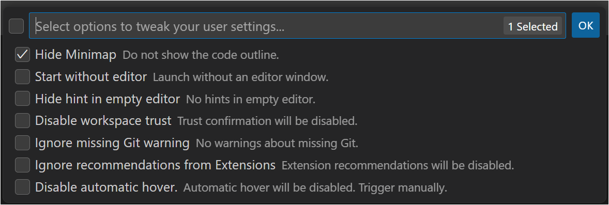
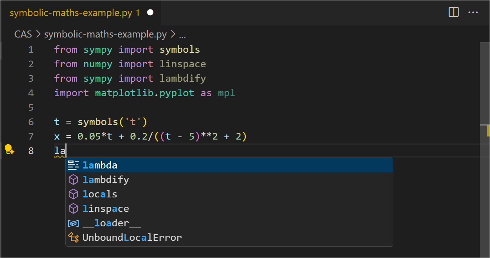

# Screen Reader Mode README


**An extension for Visual Studio Code designed for those who rely on screen readers such as [NVDA](https://www.nvaccess.org/), [JAWS](https://www.freedomscientific.com/products/software/jaws/), and [VoiceOver](https://support.apple.com/en-us/guide/voiceover/welcome/mac).**
It offers enhanced user experience for blind programmers, making it especially valuable for students learning to code.
The extension offers easy tweaking of user settings and simplifies the output of Python scripts. It may be used with any programming languages.

## Table of Contents
- [Features](#features)
- [Installation](#installation)
- [Usage](#usage)
- [License](#license)
- [Visual Studio Code Accessibility Features](#visual-studio-code-accessibility-features)
- [Release Notes](#release-notes)

## Features
### 1. Screen Reader Mode: Tweak User Settings


**Use this to enhance the user experience for blind programmers**.

Choose from the below options. They will affect the user interface and certain notifications:

- **Hide minimap**: Hide the code outline. The minimap can obscure parts of the code when collaborating with a teacher or other sighted person.
- **Start without editor**: Visual Studio Code will launch without opening an editor window.
- **Hide hint in empty editor**: Hints will not appear in an empty editor.
- **Disable workspace trust**: Trust confirmation isn’t needed when working on your own files.
- **Ignore missing Git warning**: If you don’t use Git, this will prevent VSCode from displaying warnings about Git not being installed.
- **Ignore recommendations from Extensions**: Extension recommendations will not be shown.
- **Disable automatic hover**: Hover will be disabled but can still be triggered manually.

### 2. Screen Reader Mode: Toggle Accessibility Verbosity

**Use this feature to prevent screen readers from announcing accessibility information**.

While such information can be helpful, it may become repetitive or distracting over time. For example, each time you access the terminal, the screen reader will announce:
“*Use Alt+F1/Option+F1 for terminal accessibility help*.”

```
// Excerpt from user settings:
// Provide information about how to access the terminal accessibility help menu when the terminal is focused.
"accessibility.verbosity.terminal": false
```

### 3. Screen Reader Mode: Toggle Accessibility Signals

**Use this feature to prevent screen readers from announcing accessibility signals**.

Accessibility signals include sounds and announcements that indicate markers in your code, such as errors, warnings, and breakpoints.
While these signals can be helpful, but they may become repetitive or distracting over time—similar to accessibility verbosity.
For example, when you navigate to a line with an error, an error message will be announced and a sound will play simultaneously.

```
// Excerpt from user settings:
// Plays a signal - sound (audio cue) and/or announcement (alert) - when the active line has an error.
"accessibility.signals.lineHasError": {
	"sound": "off",
	"announcement": "off"
}
```

### 4. Screen Reader Mode: Toggle Automatic Quick Suggestions


**Use this to prevent automatic quick suggestions and parameter hints from appearing while typing**.

Automatic suggestions and hints can be challenging to use with a screen reader. For a better experience, consider disabling them. Instead, trigger suggestions and hints manually when needed. This setting also affects suggestions in the terminal.

### 5. Screen Reader Mode: Run current Python script

**Use this to run the active Python script in a terminal named "Python" with minimal output**.

Other methods of running Python files may produce excessive output, which can be challenging for screen reader users.
Unnecessary text takes up valuable space on a braille display and can cause text-to-speech to become cluttered or distracting.

```
# Terminal output when executing Python script from Run > Run Without Debugging:
prompt> & 'c:\Users\<userID>\AppData\Local\Programs\Python\Python312\python.exe' 'c:\Users\<userID>\.vscode\extensions\ms-python.debugpy-2024.10.0-win32-x64\bundled\libs\debugpy\adapter/../..\debugpy\launcher' '64457' '--' 'c:\Users\<userID>\Documents\Coding\hello.py' 
Hello world!

# Terminal output when executing Python script from Run Python File:
prompt> & C:/Users/<userID>/AppData/Local/Programs/Python/Python312/python.exe c:/Users/<userID>/Documents/Coding/hello.py
Hello world!

# Terminal output when executing Python script with the feature Run current Python script included in this extension:
prompt> python hello.py
Hello world!
```

## Installation
1. From Extensions view, search for and install the extension, or
1. Install the extension from [https://marketplace.visualstudio.com/items?itemName=Statped.screen-reader-mode](https://marketplace.visualstudio.com/items?itemName=Statped.screen-reader-mode)
2. Restart Visual Studio Code

## Usage

### Available Commands and keyboard shortcuts
Commands are available from the Command Palette. Some commands also have assigned keyboard shortcuts.

| Screen Reader Mode Commands   | Windows   | macOS|Description |
| -----------| -----------    | ---------- | -----------                                                   |
| __Screen Reader Mode: Tweak User Settings__   | N/A | N/A | Disable various settings to enhance user experience.   |
| __Screen Reader Mode: Toggle Accessibility Verbosity__    | N/A | N/A | Toggle Accessibility Verbosity on or off. |
| __Screen Reader Mode: Toggle Accessibility Signals__  | N/A | N/A | Toggle Accessibility Signals on or off. |
| __Screen Reader Mode: Toggle Automatic Quick Suggestions__    | N/A | N/A | Toggle automatic quick suggestions and parameter hints on or off. |
| __Screen Reader Mode: Run current Python script__ | __Ctrl+Alt+F5__   | __Control+Option+F5__ | Run the current Python script in a terminal named Python with minimal output. |

Below you'll find some standard VSCode commands that may also be useful.

| VSCode Commands   | Windows   | macOS|Description |
| -----------| -----------    | ---------- | -----------                                                   |
| __Trigger Suggest__ | __Ctrl+Space__ | __Control+Space__ | Show suggestions. |
| __Show or focus hover__ | __Ctrl+K Ctrl+I__| __Command+K Command+I__ | Manually trigger hover. |
| __Trigger Parameter Hints__ | __Ctrl+Shift+Space__ | __Shift+Command+Space__ | Show parameter hints. |
| __Show Notifications__ | __Ctrl+Shift+Alt+N__ | __Command+K Shift+Command+N__ | Show notifications. |
| __Open Accessibility Help__ (editor or terminal) | __Alt+F1__ | __Option+F1__ | Show accessibility help for the editor or terminal. |

## License
GPL-3.0.

## Visual Studio Code Accessibility Features
A description of all accessibility features in Visual Studio Code can be found at [code.visualstudio.com/docs/editor/accessibility](https://code.visualstudio.com/docs/editor/accessibility).

## Release Notes

### [2.0.18] - 2025-11-20
See [CHANGELOG](CHANGELOG.md).